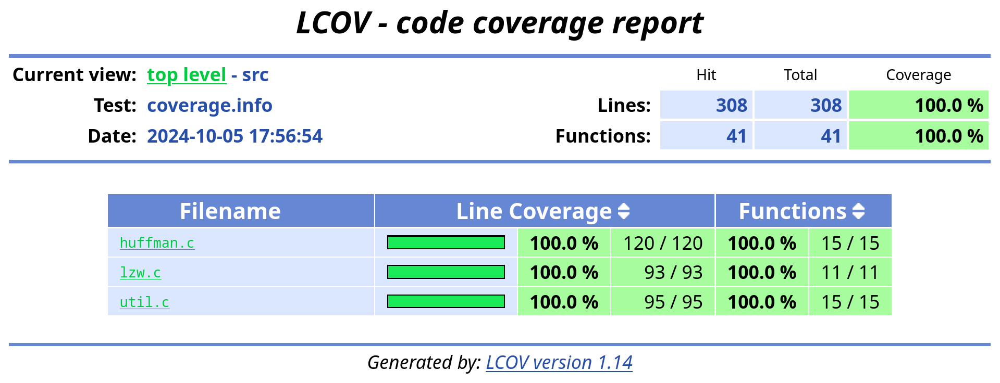

# Testausdokumentti
## Yksikkötestien kattavuusraportti

Raportti löytyy valmiina selaimella luettavassa muodossa 'coverage/index.html'-tiedostosta.
Halutessaan sen voi päivittää juurihakemistossa "make coverage"-komennolla, mikäli make, gcc, ja lcov ovat asennettuna. 

## Yksikkötestit
Kaikki funktiot (pois lukien util.c ja main.c, jotka vastaavat I/O:sta ja käyttöliittymästä) on testattu funktiokohtaisilla yksikkötesteille. Yksikkötestit voi ajaa juurihakemistossa komennolla "make test", mikäli make ja gcc ovat asennattuna.

Huffmanin koodauksen osalta yksikkötestejä tehdään pääosin kahdella koodauksella. Ensimmäinen yksinkertaisesti invertoi tavujen binääriesityksen (89=>166, 201=>54, jne.). Toinen luo eripituiset koodit joka tavulle (0=>1, 1=>00, 2=>011, 3=>0100, jne.). Erityisesti ensimmäisen tapauksessa koodauksen oikeellisuuden tarkistus on helppo tehdä luotettavasti yksikkötesteissä. Tällöin tulee kuitenkin testattua hyvin suppeasti vain tavun mittaisia koodeja, joita toinen koodaus pyrkii täydentämään aina kun mahdollista.

Tarkemmat tiedot Huffmanin yksikkötesteistä:
* **test_huffman_node_create** - Testaa, että luotu solmu on vastaa parameterina annettuja arvoja
* **test_huffman_heap_insert_256_nodes** - Lisää minimikekoon enimmäismäärän (256) solmuja. Katsoo, että keon koko on oikea, kaikki solmut on varmasti lisätty ja kekoehto täytyy.
* **test_huffman_heap_pop_256_nodes** - Lisää minimikekoon enimmäismäärän (256) solmuja ja poistaessa varmistaa, että kaikki tulee oikeassa järjestyksessä.
* **test_huffman_read_frequencies_file_random_10K** - Testaa, että tiedostosta luetut frekvenssit vastaavat Pythonilla laskettuja.
* **test_huffman_create_tree_uniform_freqs** - Testaa, että luotu puu tasaiseselle tavujakaumalle on täydellinen (=kaikki koodit 8 pituisia) ja kaikille tavuarvoille löytyy polku.
* **test_huffman_create_tree_biased_freqs** - Testaa, että yleisimmät tavut saavat puuhun lyhimmät koodit.
* **test_huffman_find_codes_inverted_coding** - Testaa, että puusta lasketut koodit ylempänä kuvatulle koodaukselle ovat oikeat.
* **test_huffman_find_codes_all_lengths_coding** - Sama toiselle koodaukselle.
* **test_huffman_write_tree_inverted_coding** - Testaa, että ylempänä kuvatun koodauksen puun serialisointi  vastaa Pythonilla laskettua.
* **test_huffman_write_tree_all_lengths_coding** - Sama toiselle koodaukselle.
* **test_huffman_read_tree_inverted_coding** - Testaa, että ylempänä kuvatun koodauksen puu luetaan tiedostosta oikein.
* **test_huffman_read_tree_all_lengths_coding** - Sama toiselle koodaukselle.
* **test_huffman_encode_data_inverted_coding** - Testaa, että kaikkia tavuja vastaavat koodit kirjoitetaan tiedostoon odotetusti.
* **test_huffman_decode_data_inverted_coding** - Testaa, että kaikkia tavuja vastaavat koodit luetaan tiedostosta odotetusti.

LZW:n osalta kaikki aputietorakenteiden funktiot on yksikkötestattu kattavasti:
* **test_lzw_dict_init** - Testaa, että purkamiseen käytetty hajautustaulu alustetaan oikein, eli on oikean kokoinen, koodin pituus on aluksi oikea ja sieltä löytyy yksittäisiä tavuja vastaavat avaimet.
* **test_lzw_dict_hash** - Testaa, että hash-funktion jakauma laskettaessa kaikilla mahdollisilla avaimilla on täydellisen tasainen. Tämä on mahdollista, joten sitä edellytetän.
* **test_lzw_dict_get_single_tokens** - Testaa, että kaikki yhtä tavua vastaavat koodaukset saa luettua hajautustaulu.
* **test_lzw_dict_get_key_with_prefix** - Testaa, että tavallista avainparia (543, 210) vastaava arvo löytyy oikein hajautustaulusta, kun se on siellä.
* **test_lzw_dict_get_collission** - Testaa, että oikeaa avainta vastaava arvo löytyy siinäkin tapauksessa, että hajautusarvojen kohdalla tapahtuu yhteentörmäys.
* **test_lzw_dict_get_invalid_key** - Testaa, että hajautustaulu palauttaa oikeat arvot, kun etsittyä avainta ei ole vielä lisätty.
* **test_lzw_dict_insert_one** - Testaa, että hajautustauluun lisätty yksittäinen arvo todella tallentuu sinne.
* **test_lzw_dict_insert_max_amount** - Testaa, että hajautustaulu toimii ja kaikki arvot tallentuvat, kun lisätään niitä koodien enimmäismäärän verran.
* **test_lzw_dict_insert_when_full** - Varmistaa, että tauluun ei voi lisätä enimmäismäärää enempää koodeja.
* **test_lzw_table_init** - Testaa, että merkkijonotaulukko alustetaan oikein, eli se on oikean kokoinen, koodin pituus on aluksi oikea ja sieltä löytyy yksittäisiä tavuja vastaavat avaimet.
* **test_lzw_table_print** - Testaa, että merkkijonotaulukkoon koodattu usean merkin mittainen merkkijono tulostuu oikein.
* **test_lzw_table_insert_one** - Testaa, että taulukkoon lisätty yksittäinen uusi merkkijono todella tallentuu sinne oikealla koodilla.
* **test_lzw_table_insert_one** - Testaa, että taulukkoon voidaan lisätä enimmäismäärä merkkijonoja, ja että ne tallentuvat odotetulla tavalla.
* **test_lzw_table_insert_when_full** - Varmistaa, että taulukkoon ei voi lisätä enimmäismäärää enempää koodeja.

Pelkillä yksinkertaisilla yksittäisi funktioita testaavilla yksikkötesteillä ei ole mahdollisuutta kokeilla kattavasti koko pakkaus/purkualgoritmeja, sillä jo odotettujen tulosten laskeminen käsin käy nopeasti hyvin hankalaksi. Lisäksi voi olla, että ongelmia alkaa ilmetä vasta erittäin isoilla syötteillä. Helppo tapa lisätä kokonaisvaltaisia yksikkötestejä on pakata jokin tiedosto pakkausalgoritmilla ja purkaa se purkualgoritmilla ja varmistaa, että saadaan alkuperäinen tiedosto. Lisäksi voidaan varmistaa, että pakkaussuhde on oikeansuuntainen.

Molempia algoritmeja testataan yksikkötesteissä seuraavilla tiedostoilla:
- **lorem_256B.txt** - 256-merkkinen ASCII-tekstitiedosto.
- **random_10K.bin** - 10 kilotavun satunnaisesti generoitu tiedosto.
- **random_5M.bin** - 5 megatavun satunnaisesti generoitu tiedosto.
- **empty.bin** - Tyhjä tiedosto.
- **only_ones_10K.bin** - Tiedosto, joka sisältää vain 10 kilotavun edestä ykkösbittejä.
- **pride_and_prejudice.txt** - Ylpeys ja ennakkoluulo -kirja UTF8-koodattuna tekstitiedostona. Tämän osalta testataan myös pakkaussuhde.

## Testaus todenmukaisilla syötteillä
Pakkaussuhde on tässä pakatun tiedoston koko suhteessa pakkaamattomaan tiedoston kokoon. Käytetyllä kiintolevyllä (SSD vs HDD) ero on merkittävä, suoritusajat ovat selvästi parempia SSD-levyllä. Kaikissa tapauksissa on lisäksi varmistettu, että tiedosto pysyi samana (**oikeellisuustestaus**).

**Romeo and Juliet -kirja (englanninkielinen UTF-8) (161K)**
||Huffman|LZW|
|-|-|-|
|Pakkaussuhde|0.621|0.461|
|Pakkausaika|1 ms|4 ms|
|Purkuaika|4 ms|1 ms|

**Pride and Prejudice -kirja (englanninkielinen UTF-8) (740K)**
||Huffman|LZW|
|-|-|-|
|Pakkaussuhde|0.573|0.420|
|Pakkausaika|8 ms|19 ms|
|Purkuaika|18 ms|5 ms|

**King James Version -raamattu (englanninkielinen UTF-8) (4.4M)**
||Huffman|LZW|
|-|-|-|
|Pakkaussuhde|0.582|0.440|
|Pakkausaika|56 ms|114 ms|
|Purkuaika|111 ms|32 ms

**Sota ja rauha e-kirja (suomenkielinen UTF-8) (870K)**
||Huffman|LZW|
|-|-|-|
|Pakkaussuhde|0.567|0.441|
|Pakkausaika|25 ms|73 ms|
|Purkuaika|41 ms|15 ms|

**Kiinankielinen e-kirja (UTF-8) (276K)**
||Huffman|LZW|
|-|-|-|
|Pakkaussuhde|0.757|0.604|
|Pakkausaika|7 ms|19 ms|
|Purkuaika|15 ms|6 ms

**Valtion budjettikatsaus (PDF) (5.29M)**
||Huffman|LZW|
|-|-|-|
|Pakkaussuhde|0.992|1.355|
|Pakkausaika|62 ms|80 ms|
|Purkuaika|145 ms|39 ms|

**Maisemakuva (JPG) (9.77M)**
||Huffman|LZW|
|-|-|-|
|Pakkaussuhde|0.999|1.437|
|Pakkausaika|101 ms|143 ms|
|Purkuaika|243 ms|72 ms|

**Äänitiedosto (wav) (1M)**
||Huffman|LZW|
|-|-|-|
|Pakkaussuhde|0.847|1.001|
|Pakkausaika|12 ms|40 ms|
|Purkuaika|25 ms|6 ms|

**Satunnaista dataa sisältävä tiedosto (1G)**
||Huffman|LZW|
|-|-|-|
|Pakkaussuhde|1.000|1.437|
|Pakkausaika|10 443 ms|14 894 ms|
|Purkuaika|24 687 ms|8 426 ms|